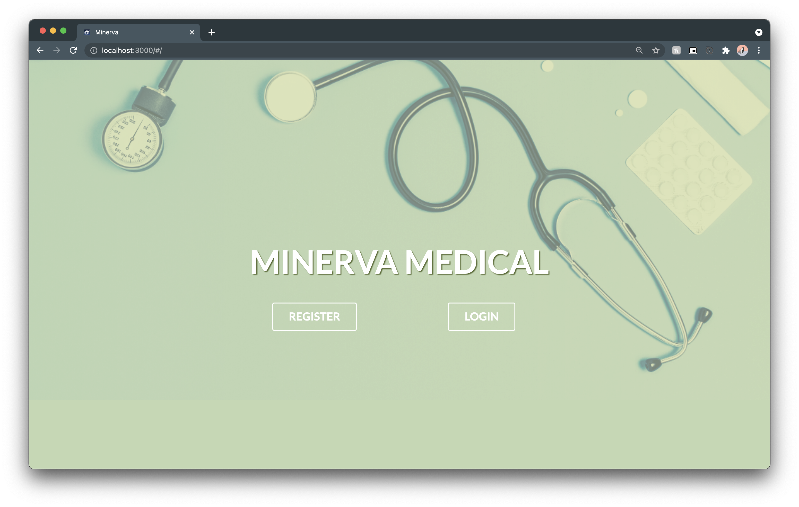
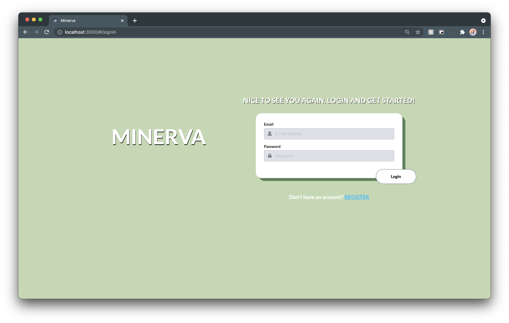
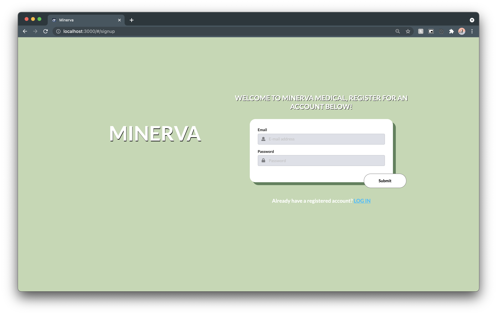
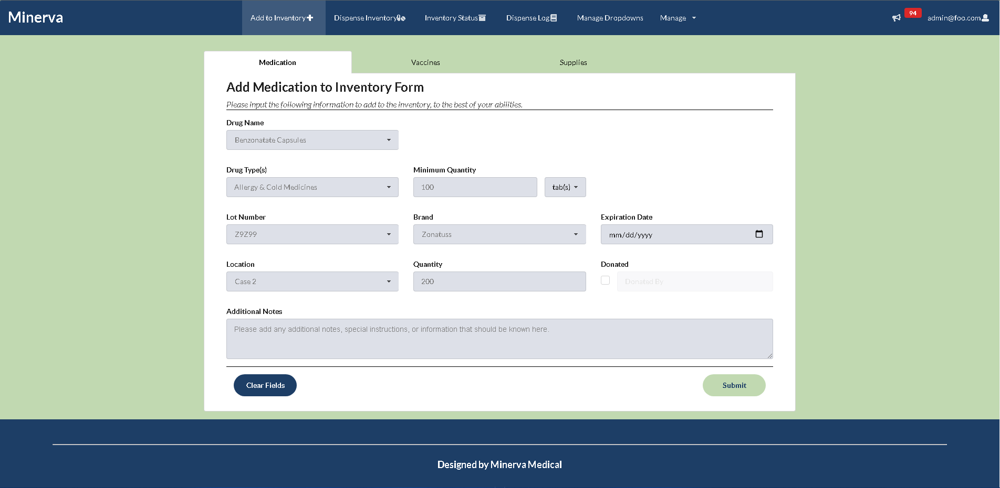
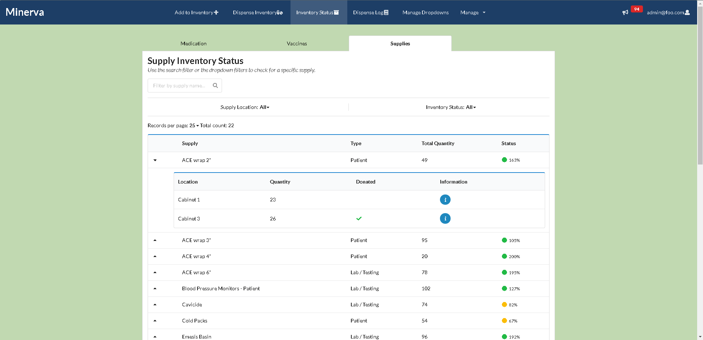

<!-- Minerva Medical -->

## Table of contents

* [Overview](#overview)
* [Goal](#goal-of-the-application)
* [User Guide](#user-guide)
* [Developers](#developer-guide)
* [Development History](#development-history)
* [Contact Us](#contact-us)


## Overview

Welcome to _**Minerva Medical!**_ The goal of this project is to create and provide an application that keeps track of supply inventory for the _**Hawaii Homeless and Medical Outreach Project H.O.M.E**_, who helps provide medical care to residents around the island by means of a mobile clinic. 
Our team hopes to create a suitable application that not only assists the staff at _**Hawaii H.O.M.E**_, but also assists in providing a smoother patient experience. You can view our client's website and goal [here](https://sites.google.com/view/hawaiihomeproject/about?authuser=0).

## Goal of the Application

This application will keep track of inventory for items such as medications, vaccinations, lab tests/supplies, and patient supplies. We also intend for the application to keep patient medical records up to date with any vaccine or medication history. An example of this is the displaying of vaccine information on a patients medical chart if they have received that vaccine. We also have the goal of providing the location of each item in the mobile clinic's inventory so that staff are able to easily access products. After completion, we hope to have the staff at Medical Outreach Clinic utilize this application in addition to their medical records application _**Athena**_ to provide a smoother experience for both the staff and the patients. 

## User Guide

With the exception of a few forms and user account management for the admin users (add supplies form and dispense vaccine form), our application is complete and has fully implemented mock data to simulate real usage. Below are screenshots of the pages created in our application. As of now, the only pages that are not fully functional are the dispense vaccine page, the add supply page, and the user management pages when logged into the admin account. Although incomplete, these pages are definitely updatable in the future, where we can work towards providing a fully functional web application for the staff at the Hawaii H.O.M.E project. 

### Our Progress...
### Landing Page
The user is prompted to the landing page containing the sites name and logo. Here they are presented with two options to login or register a new account.



### Login and Sign-Up Page
When the user clicks the “Login” button they are prompted to a page in which they must enter their existing email and password.



Alternately, when the user clicks the “Register” button they are prompted to a page in which they must enter their username, email and password. As of right now, this page is implemented due to the user management page not fully functioning. Once that is complete, we will be able to remove the register page and have users log in with an account made and assigned by an admin user. 



### Add to Inventory Form 
If the user wants to add an item to the inventory, they will do so by using the add inventory form. This form is accessible through the "Add Inventory" tab in the navigation bar. This form will have the user fill out the following fields when adding an item: 

* Item type
* Drug Name 
* Drug Type(s)
* Brand
* Lot Number
* Expiration date 
* Minimum Quantity
* Quantity + Unit
* Location
* Whether the item was purchased or donated
* Additional information

The form will also autofill when a lot number has been inputted into the form. For example, if a lot number is filled in, then the rest of the fields associated with that lot number (medication name, brand, location, etc) will auto fill, providing a smoother experience for the user. 
Once the form is completed, the item will be added to the inventory and will be displayed on the Inventory Status page. 

<br>
Below is the Add Medication form

<br>
<br>
Below is the Add Vaccine form

<br>
<br>
Below is the Add Supply form


### Inventory Status Page
The user will be brought to the status page when selection the "Status Inventory" navbar item. Once arriving to the page, the user will be presented with a table of the items in the inventory. The page is broken up into tabs with different inventory items, where the user has the option to go through each tab to view the inventory associated with the type of item selected (medications, vaccinations, etc). This table will include information such as the type of supply/medication, name of the drug/vaccine/supply, location, current quantity in the inventory, lot number, and status. Each table row will have a cell that has an information button, the user will be brought to a modal containing more information about the selected item. The user is also able to view their profile on the top right of the navbar or sign out of their account. This page will also include a status dot that is either green (for high quantity), yellow (item needs to be restocked soon), and red (item needs to be restocked ASAP). The Inventory Status page will also incorporate pagination, which will provide users the ability to view items that are not able to fit on one page. As of right now, all tabs are currently fully functional, and include the abillity to edit notes for all items in the inventory. Each item on the list can also be deleted when pulling down the accordion for each medication, supply, or vaccine.

<br>
Below is the medication inventory list

<br>
<br>
Below is the vaccine inventory list

<br>
<br>
Below is the supply inventory list


### Inventory Modal Page
Each item that appears on the inventory status page will have an individual information page that can be accessed through the status page by clicking on the information button associated with each inventory item row. This page will include more information about the item/medication, as well as additional notes that may have been added by another user during the time of adding the item to the inventory. This modal also will include an edit button, where users will have the ability to make an edit to the notes inputted of the item. Users will also have the ability to delete an item through this modal.

<br>
Below is the information modal displayed for a medication


<br>
Below is the edit notes modal available for users. 


### Dispense Form Page 
When a user wants to dispense a medication or supply, they will be able to fill out a form that will help with documentation and updating the inventory. This form is accessible through the navigation bar as the "Dispense Inventory" tab. This form have users fill out the following fields: 

* Date of dispense
* Who was dispensing the medication 
* The type of inventory item that is being dispensed (medication, vaccines, patient supplies, or lab testing supplies)
* Reason for dispense
* Who the item was dispensed to
* The site that the dispense occurred
* The drug name, the lot number
* The expiration date
* Brand
* Quantity dispensed
* Units dispensed
* Additional notes that the user wants to include
 
The date dispensed and the dispensed by fields are already configured to be autofilled by the current date and time and the current user. This will help provide the user with a better experience. Users will also be able to clear the form if a mistake was made during the filling out process. Users will also have the ability to dispense mulitple medications at a time when necessary by clicking on the "add a new drug" tag at the bottom of the form. When clicked, more fields will be added to the form, which will allow users to add more items to dispense at a time. 

<br>
Below is the Dispense Medication form

<br>
<br>
Below is the dispense vaccine form

<br>
<br>
Below is the dispence supply form


### Dispense History Page 
The user will also be able to see what medications and supplies have been dispensed using the dispense history page, which can be accessed in the navigation bar as the "Dispense Log" tab. This log will include the date and time the item was dispensed, reason for dispense, the item that was dispensed, the brand of that item, how much was dispense, and the user that logged the dispensed item at the time. Users will also have the ability to filter through the log using patient numbers or dates dispensed as a means of filtering. This page also implements the use of pagination.


### Dispense History Modal Page
Similar the Status Inventory page, the Dispense History page will also implement the use of a modal. The modal will include more information on the item dispensed. 


### Manage Dropdowns
Users will also have the abilty to access the manage dropdowns page, which will allow users to add or remove fields that will be useful when filling out a form in our application. If the user decides to add a new field, such as a new location, then that location will then be available as a selection when filling out the add or dispense forms. 


### Admin - User Management
Our team also decided to implement a means of managing user accounts in out web application. When logged in as an admin users, users will be able to either create, edit, or view a list of how many users are using the application. Users will be able to create an account for new user (such as a student) and create credentials for that user to login. Once the account is created, users will be redirected to the application logged in as the new user that had just been created. As of right now, the account editing page has not been implemented, and the account creation page is not fully functional. 

<br>
Below is the general user management page, where admin users can either create a user account, edit a user account, or view a list of how many users are in the web application database.


<br>
Below is the list user page 


<br>
Below is the create a user page


### Logoff Page
Upon logging off the site the user is prompted with a goodbye message confirming that they have logged off the system. Here they have an option of logging back in or going back to the landing page. 


## Developer Guide
If you wish to install the _**Minerva**_ application locally, you can follow the directions below. 

First, [install Meteor](https://www.meteor.com/install).

Second, download a copy of [Minerva](https://github.com/minerva-medical/minerva-matrp).

Third, open up your terminal/command prompt and cd into the app directory of the Minerva Medical copy you had just downloaded
and install the necessary libraries by invoking meteor npm install:

```
$ meteor npm install
```

After meteor is installed, you can run the application by typing in the command:

```
$ meteor npm run start
```


The first time you run the app, it will create some default users that have been added to the database. Here is an
example of how the output may look:

```
I20201119-23:01:44.024(-10)? Creating the default user(s)
I20201119-23:01:44.024(-10)?   Creating user admin@foo.com.
I20201119-23:01:44.332(-10)?   Creating user john@foo.com.
I20201119-23:01:44.754(-10)? Monti APM: completed instrumenting the app
=> Started your app.
```

Note regarding bcrypt warning: You may also get a similar message when running this application:

```
=> Started proxy.                             
=> Started MongoDB.                           
W20201119-22:58:19.472(-10)? (STDERR) Note: you are using a pure-JavaScript implementation of bcrypt.
W20201119-22:58:19.515(-10)? (STDERR) While this implementation will work correctly, it is known to be
W20201119-22:58:19.516(-10)? (STDERR) approximately three times slower than the native implementation.
W20201119-22:58:19.516(-10)? (STDERR) In order to use the native implementation instead, run
W20201119-22:58:19.516(-10)? (STDERR) 
W20201119-22:58:19.516(-10)? (STDERR)   meteor npm install --save bcrypt
W20201119-22:58:19.516(-10)? (STDERR) 
W20201119-22:58:19.517(-10)? (STDERR) in the root directory of your application.
I20201119-22:58:20.471(-10)? Monti APM: completed instrumenting the app
=> Started your app.
```

On some operating systems (particularly Windows), installing bcrypt is much more difficult than implied by the above
message. Bcrypt is only used in Meteor for password checking, so the performance implications are negligible until your
site has very high traffic. You can safely ignore this warning without any problems during initial stages of
development.

If all goes well, the template application will appear at http://localhost:3000. You can login in using the credentials
in setting.development.json, or else you can register an new account.

Lastly, you can run ESLint over the code in the imports/directory with:

```
$ meteor npm run lint
```

## Development History
### Milestone 1
If you would like to view the progress made for Milestone 1, you can view it [here](https://github.com/minerva-medical/minerva/projects/1). <br>
For Milestone 1, our team created mockup pages for the dispense page, inventory status page, dispense history page,  and the individual medication page. We were able make changes to the login and sign out pages, as well as implement color patterns into out application. Our goal for the next milestone is to incorporate the data provided to us by the client into our application, providing an experience that is closer to the final product. 

### Milestone 2
If you would like to view the progress made for Milestone 2, you can view it [here](https://github.com/minerva-medical/minerva-matrp/projects/1). <br>
For Milestone 2, our team started implementing more functionality in our website. We created tabs for both the add and dispense form for the different type of items that can be added or dispensed from the inventory. We also created a default collection for the inventory, and mapped out that collection into the status and dispense-history pages. We added modals to both the status and dispense-history pages so that users will be able to view more information about the item being displayed. Our goal for the next milestone is to implement more functionality and incorporate the data provided to us by the client. 

### Milestone 3
If you would like to view the progress made for Milestone 3, you can view it [here](https://github.com/minerva-medical/minerva-matrp/projects/2). <br>
For Milestone 3, our team implemented form functionality such as adding and dispensing medication, and updating medication notes. Other features include forms auto-filling upon the selection of a lot number, sweet alert timeouts, and forms clearing upon successful insert/update. In addition, we implemented some filter features to the status and dispense log pages. Also, we imported the sample inventory .csv file to our Medications collection so we have real data to work with. Lastly, we made several UI changes such as improving layouts and responsiveness. Our goal for the next milestone is to implement more functionality for the status and dispense log pages and begin adding vaccinations and supplies.

### Milestone 4
If you would like to view the progress made for Milestone 4, you can view it [here](https://github.com/minerva-medical/minerva-matrp/projects/4). <br>
For Milestone 4, our team implemented the vaccine collection, and made updates to the historical medical collection. We also made UI changes to enhance the user experience, such as implementing a drop down and filtering functionality on the status page. We also implemented a new tab in the nav bar called "Manage Dropdowns", which allows users to manage the different medications, supplies, vaccinations, and locations when filling out the add or dispense forms. We also implemented more filtering functionality for the dispense log page to help users look for a dispensed item based on the date it was dispensed or patient ID. 

### Milestone 5
If you would like to view the progress made for Milestone 5, you can view it [here](https://github.com/minerva-medical/minerva-matrp/projects/5). <br>
For Milestone 5, our team implemented more functionality into the website, such as implementing a table accordian for the status page, which allows medications on the table to have accordions associated with them based on how many lot numbers there are for the medication. We also created the supply collection, and worked on having a functional add supply form. During this milestone, a data fixture was also implemented for the dispense log page, which now displays a large amount of dispensed medication. We also worked on updating the status modal for each medication, and enable pagination for both the status and dispense log pages. Our team also implemented a delete function for the medications in the status page. Lastly, we updated acceptance testing and deployed our application. 

### Milestone 6
If you would like to view the progress made for Milestone 6, you can view it [here](https://github.com/minerva-medical/minerva-matrp/projects/6). <br>
For Milestone 6, our team made the final touch ups to our web application. We implemented the functionality of the dispense forms for the supply form. Unfortunately at this time, we were unable to complete full functionality for the dispense vaccine form and the add supply form. However, if our team decides to continue to work on this project, we will definetely be able to address these issues. Our team also implemented a notification icon in the navbar to the notify the user how many medicatinos are out of stock or low in stock. We also worked on implementing any missing pages such as the vaccine status page, and implemented information modals for each of those pages as well. Lastly, we worked on making the application mobile compatable, updated acceptance testing, and redeployed the application. 

## Contact Us
If you would like to contact the creators of _**Minerva Medical**_ you can email us at:

[Glen Larita](https://glarita.github.io/) - glarita@hawaii.edu\
[Mujitaba Quadri](https://mujtaba-a-quadri.github.io) - mujtabaq@hawaii.edu\
[Len Nguyen](https://len-nguyen.github.io) - lenn99@hawaii.edu\
[Jessica Ocampo](https://jnocampo.github.io) - jnocampo@hawaii.edu\
[Alyssandra Cabading](https://alyssandra-cabading.github.io) - alyssand@hawaii.edu\
[Jake Hijirida](https://jakehiji.github.io) - jakehiji@hawaii.edu\
[Guanhong Li](https://guanhongl.github.io) - guanhong@hawaii.edu
