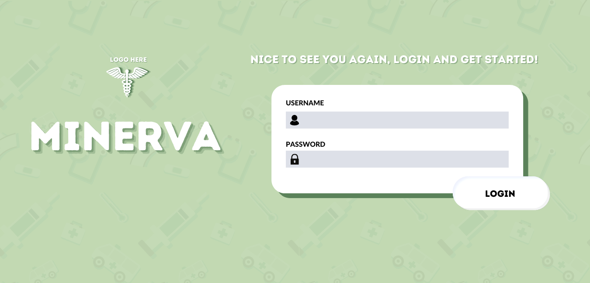

<!-- Minerva Medical -->

## Table of contents

* [Overview](#overview)
* [Goal](#goal-of-the-application)
* [Mockups](#mockups)
* [Developers](#developer-guide)
* [Development History](#development-history)
* [Team](#team)

## Overview

Welcome to Minerva Medical! The goal of this project is to create and provide an application that keeps track of supply inventory for the Medical Outreach Clinic, who help residents around the island by means of a mobile clinic. 
Our team hopes to create a suitable application that not only assists the staff at Medical Outreach Clinic, but also assists in providing a smoother patient experience. 

## Goal of the Application

This application will keep track of inventory for items such as medications, vaccinations, lab tests/supplies, and patient supplies. We also intend for the application to keep patient medical records up to date with any vaccine or medication history. An example of this is the displaying of vaccine information on a patients medical chart if they have received that vaccine. We also have the goal of providing the location of each item in the mobile clinic's inventory so that staff are able to easily access products. After completion, we hope to have the staff at Medical Outreach Clinic utilize this application in addition to their medical records application _**Athena**_ to provide a smoother experience for both the staff and the patients. 

## Mockups
###Landing Page
The user is prompted to the landing page containing the sites name and logo. Here they are presented with two options to login or register a new account.

###Login and Sign-Up Page
When the user clicks the “Login” button they are prompted to a page in which they must enter their existing username and password.

Alternately, when the user clicks the “Register” button they are prompted to a page in which they must enter their existing first and last name, username, employeeID (subject to change) and password.


## Developer Guide
If you wish to install the Minerva Medical application locally, you can follow the directions below. 

First, [install Meteor](https://www.meteor.com/install).

Second, download a copy of [Minerva Medical](https://github.com/minerva-medical) (will need to update link when repo is created) from Github.

Third, open up your terminal/command prompt and cd into the app directory of the Minerva Medical copy you had just downloaded
and install the necessary libraries by invoking meteor npm install:

```
$ meteor npm install
```

After meteor is installed, you can run the application by typing in the command:

```
$ meteor npm run start
```


The first time you run the app, it will create some default users that have been added to the database. Here is an
example of how the output may look:

```
I20201119-23:01:44.024(-10)? Creating the default user(s)
I20201119-23:01:44.024(-10)?   Creating user admin@foo.com.
I20201119-23:01:44.332(-10)?   Creating user john@foo.com.
I20201119-23:01:44.754(-10)? Monti APM: completed instrumenting the app
=> Started your app.
```

Note regarding bcrypt warning: You may also get a similar message when running this application:

```
=> Started proxy.                             
=> Started MongoDB.                           
W20201119-22:58:19.472(-10)? (STDERR) Note: you are using a pure-JavaScript implementation of bcrypt.
W20201119-22:58:19.515(-10)? (STDERR) While this implementation will work correctly, it is known to be
W20201119-22:58:19.516(-10)? (STDERR) approximately three times slower than the native implementation.
W20201119-22:58:19.516(-10)? (STDERR) In order to use the native implementation instead, run
W20201119-22:58:19.516(-10)? (STDERR) 
W20201119-22:58:19.516(-10)? (STDERR)   meteor npm install --save bcrypt
W20201119-22:58:19.516(-10)? (STDERR) 
W20201119-22:58:19.517(-10)? (STDERR) in the root directory of your application.
I20201119-22:58:20.471(-10)? Monti APM: completed instrumenting the app
=> Started your app.
```

On some operating systems (particularly Windows), installing bcrypt is much more difficult than implied by the above
message. Bcrypt is only used in Meteor for password checking, so the performance implications are negligible until your
site has very high traffic. You can safely ignore this warning without any problems during initial stages of
development.

If all goes well, the template application will appear at http://localhost:3000. You can login in using the credentials
in setting.development.json, or else you can register an new account.

Lastly, you can run ESLint over the code in the imports/directory with:

```
$ meteor npm run lint
```

## Development History
Milestone 1: In progress..

Milestone 2: Start after completion of Milestone 1.

Milestone 3: Start after completion of Milestone 2.

## Team

[Glen Larita](https://glarita.github.io/) - glarita@hawaii.edu\
[Mujitaba Quadri](https://mujtaba-a-quadri.github.io) - mujtabaq@hawaii.edu\
[Len Nguyen](https://len-nguyen.github.io) - lenn99@hawaii.edu\
[Nelson Liang](https://nelson-liang.github.io) - nelson35@hawaii.edu\
[Jessica Ocampo](https://jnocampo.github.io) - jnocampo@hawaii.edu\
[Alyssandra Cabading](https://alyssandra-cabading.github.io) - alyssand@hawaii.edu\
[Jake Hijirida](https://jakehiji.github.io) - jakehiji@hawaii.edu\
[Guanhong Li](https://guanhongl.github.io) - guanhong@hawaii.edu
